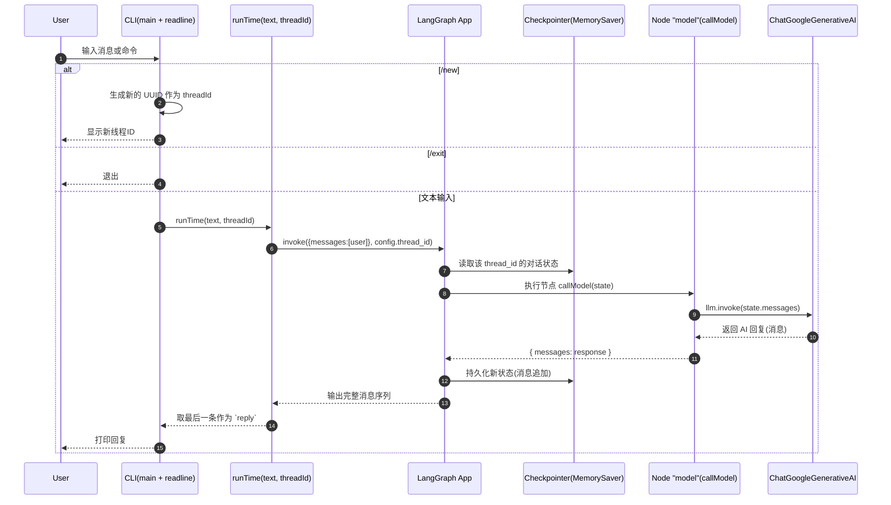

# utils/chat_bot_example.js 程序流程（含时序图）

**目标**
- 说明 `utils/chat_bot_example.js` 的整体执行流程与数据/记忆流转；给出可视化时序图，便于理解与排错。

**概览**
- **功能**: 基于 LangGraph 的 `MessagesAnnotation` 构建单节点对话流，使用 `MemorySaver` 保存对话状态；调用 Google Gemini (`@langchain/google-genai`) 生成回复。
- **入口**: 文件末尾直接调用 `main()` 启动 CLI 交互；同时导出 `runTime(userText, threadId)` 供程序化调用。
- **记忆**: 通过 `configurable.thread_id` 把同一线程的消息聚合；更换 `thread_id` 等同于开启全新会话。
- **模型**: `utils/generate_mode.js` 中创建的 `llm` 读取 `.env` 的 `GOOGLE_API_KEY`（`dotenv.config()`）。

**代码结构（文件与行号）**
- `callModel(state)`: 调用大模型并返回 `{ messages: response }`，由节点 `model` 执行。
  - `utils/chat_bot_example.js:21`
- `workflow`: `StateGraph(MessagesAnnotation)`，串联 `START -> model -> END`。
  - `utils/chat_bot_example.js:27`
- `app`: `workflow.compile({ checkpointer: new MemorySaver() })`。
  - `utils/chat_bot_example.js:33`
- `runTime(userText, threadId)`: 组装 `configurable.thread_id`，`app.invoke()`，返回最终回复与线程 ID。
  - `utils/chat_bot_example.js:42`
- `main()`: 基于 `readline` 的 CLI 循环，支持命令 `/new`（新线程）、`/exit`（退出）。
  - `utils/chat_bot_example.js:52`
- 模型定义：`llm = new ChatGoogleGenerativeAI({ model: "gemini-2.5-flash", ... })`。
  - `utils/generate_mode.js:1`

**时序图**

**关键点解析**
- **消息聚合**: `callModel` 返回 `{ messages: response }`，LangGraph 会将 AI 消息追加到会话消息数组中。
- **线程 ID**: `runTime` 若未传入 `threadId`，会生成新的 UUID；同一 `thread_id` 下的多次调用共用对话上下文。
- **记忆介质**: `MemorySaver` 为进程内内存检查点；若进程重启，历史不会保留。需要持久化可替换为外部存储实现的 checkpointer。
- **CLI 命令**: `/new` 重置为新 `threadId`；`/exit` 结束循环；其他输入会触发一次模型调用并打印回复。

**运行与集成**
- **直接运行 CLI**: `node utils/chat_bot_example.js`（项目 `package.json` 已为 ESM，直接运行即可）。
- **程序化调用**:
  - 导入：`import { runTime } from "./utils/chat_bot_example.js";`
  - 使用：`const { reply, threadId } = await runTime("你好", existingThreadId);`

**注意事项**
- `index.mjs` 当前以默认导出方式使用本模块：`import chatBotExample from "./utils/chat_bot_example.js";`，而文件实际导出为命名函数 `runTime` 并且会在导入时执行 `main()`。如需按 `index.mjs` 的示例调用，应二选一：
  - 修改导入：`import { runTime as chatBotExample } from "./utils/chat_bot_example.js";`
  - 或导出默认：在 `utils/chat_bot_example.js` 增加 `export default runTime;` 并移除/条件化 `main()` 的自执行。
- `GOOGLE_API_KEY` 需在 `.env` 中配置，避免将密钥写入代码或日志。

**小结**
- 该脚本是“单节点 LangGraph + 线程化记忆”的最小闭环：输入 -> `runTime` -> `app.invoke` -> `callModel/llm` -> 追加消息 -> 输出最后一条回复。配合 `thread_id` 即可获得“可复用上下文”的对话体验。
