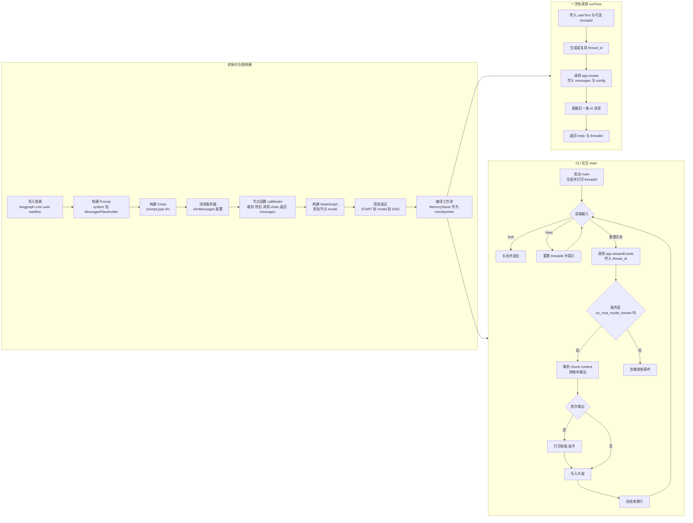

# utils/chat_bot_example.js 流程图（修正版）

本流程图基于源码梳理整体逻辑，已避免 Mermaid 解析冲突（去除引号、花括号等特殊字符）。

```text
简洁文本流程图（逻辑骨架）

[初始化]
  ├─ 导入依赖 → 构建 Prompt → 构建 Chain → 配置 trimMessages
  ├─ 定义节点 callModel（裁剪 → 调用 chain → 返回 messages）
  └─ 构建 StateGraph：START → model → END；compile 使用 MemorySaver → app

[两种运行路径]
  1) runTime(userText, threadId?)
     → 生成/复用 thread_id
     → app.invoke({ messages }, { thread_id })
     → 取最后一条 AI 消息
     → 返回 { reply, threadId }

  2) CLI main()
     → 生成 threadId 并提示
     → 循环读取输入：
         · '/exit' → 退出
         · '/new'  → 重置 threadId
         · 其他文本 → app.streamEvents({ messages }, { version:v2, thread_id })
           ↳ 仅处理 on_chat_model_stream：拼接 chunk 内容并输出；流结束换行
           ↳ 异常时打印错误并继续
```



## 关键点
- 记忆分线程：MemorySaver 配合 `configurable.thread_id` 持久化上下文；输入 `/new` 更换会话轨迹。
- 流式输出：`app.streamEvents` 仅消费 `on_chat_model_stream`，增量拼接输出；异常打印错误并继续循环。
- 消息裁剪：`trimMessages` 使用 last 策略，保留 system，近似 token 计数避免上下文过长。
- 图结构：极简单链路 START → model → END；`model` 节点即 `callModel`。
- 复用：CLI 交互与 `runTime` 共用同一 `app` 与记忆机制。

文件：`utils/chat_bot_example.js`
入口：文件底部 `main()`（可 `node utils/chat_bot_example.js` 运行）
